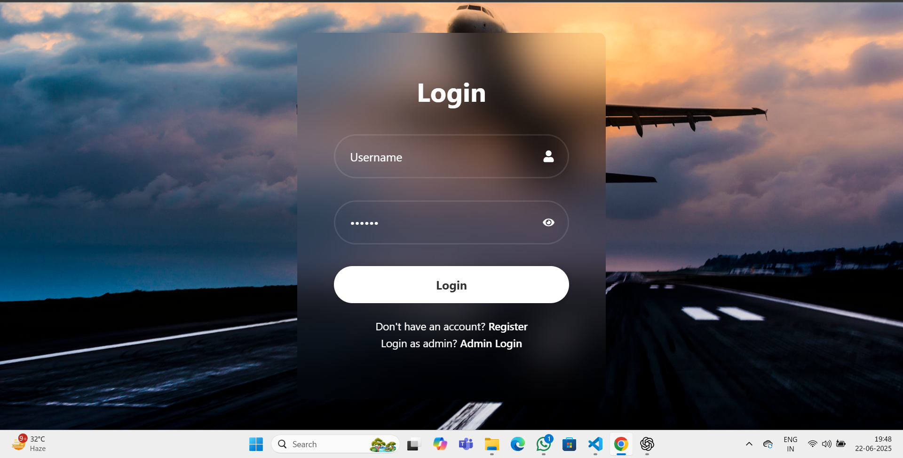
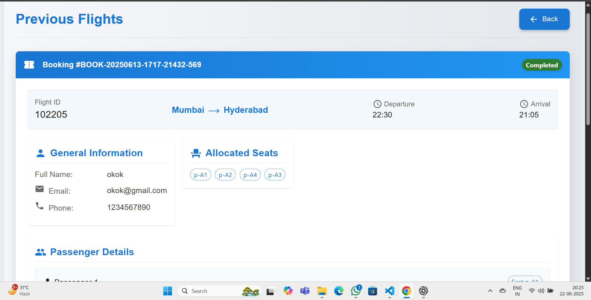
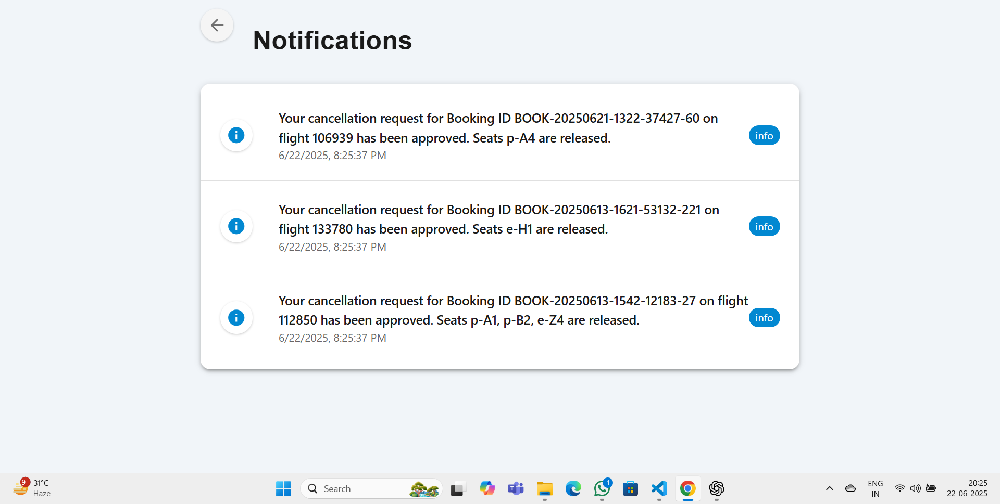
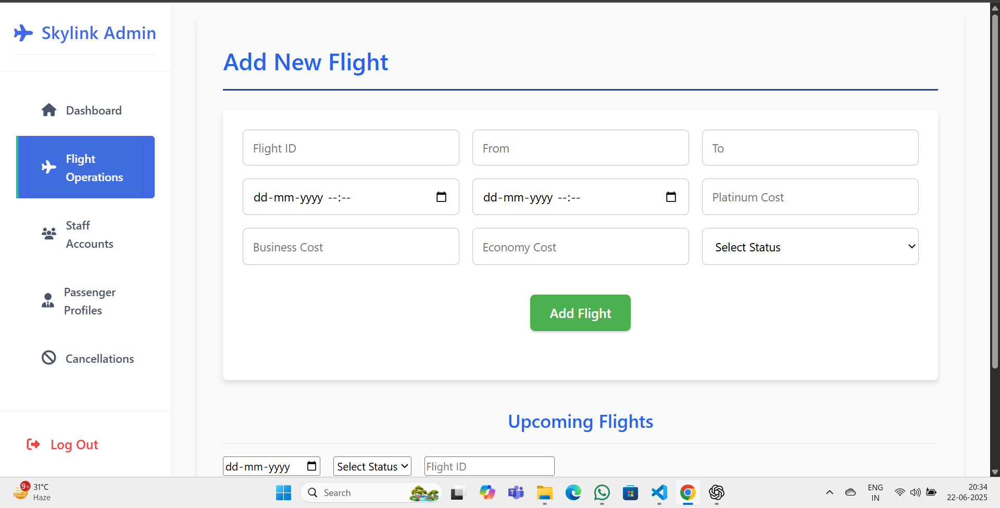
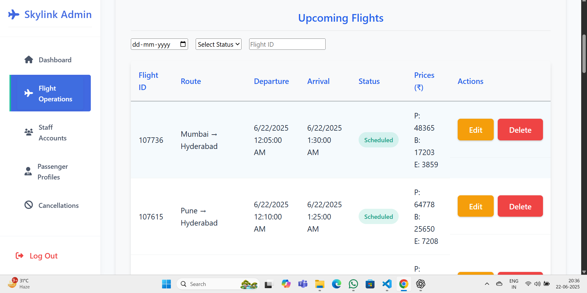
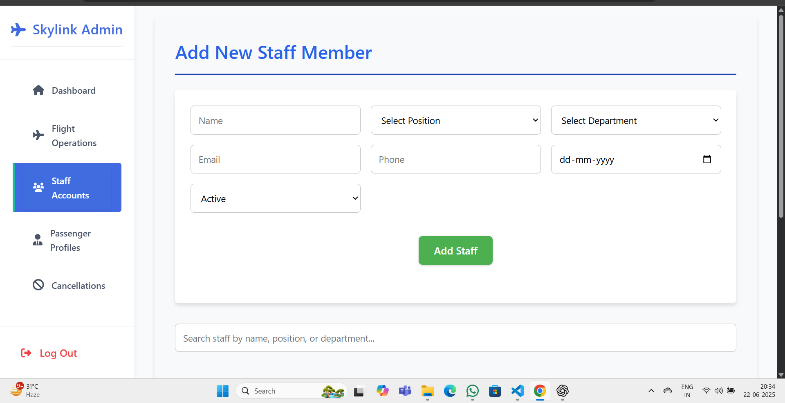
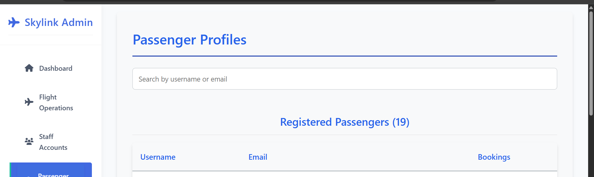
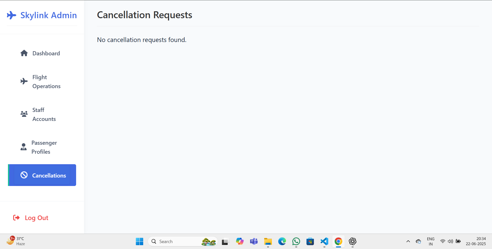

# StratoServe
## Airplane Management System

A full‑stack web application for airline operations: An intuitive platform designed for passengers and airline staff to search flights,book and cancel tickets, manage passenger data, and handle operations—all in one place.

 
## Features
 
 
### User Actions
- **Login/signup**:Users can create accounts or signin to their existing accounts securely.
  
  
  
  

- **searchflights**:Users can search their flights to their favourite destinations
  .png)
  .png)

- **Book flights/cancellation**:Users can book flights in as shown below
  .png)
  .png)
  .png)
  .png)

- **View History**:Users can view history of their previous bookings etc.
 

- **Notifications bar**:Users can view any notifications about their bookings/cancellations etc
  

### Admin Actions

- **Dashboard**: Admin can view the current active flights and the passengers travelling
  .png)

- **Add Flights/view upcoming flights**:Admin can add or remove flights and view upcoming flights
  
  

- **Add staff/view current staff members**:Admin can add and view staff members
  
 
- **Passenger Profiles**:Admin can view all the passenger profiles
   

- **cancellations requests**:Admin can approve the cancellation requests they recieve
  

### standout feature
- **Ai assistant** : Users can use the Ai assistant and can get their travelling suggestions.
 .png)
 .png)

## Tech Stack

- **Frontend**: React, Vite, CSS Modules
- **Backend**: Node.js, Express 
- **Database**: MongoDB (via mongoose)
- **Authentication**: JWT
 - In the database, if the flight's scheduled date is earlier than the current date, the system will automatically update the flight record by adding 28 days to it.

- We have overall included 35 cities for flight operations

## Getting started

### Prerequisites
- Node.js >=16
- MongoDB (local or Atlas)
- (Optional) .env variables: `PORT`, `MONGO_URI`, `JWT_SECRET`

### How to run

- git clone your-repo-url
- cd air
- cd backend && npm install
- npm start                  
  runs backend on http://localhost:5000
- cd ../frontend && npm install
- npm start             
 runs React frontend on http://localhost:3000
